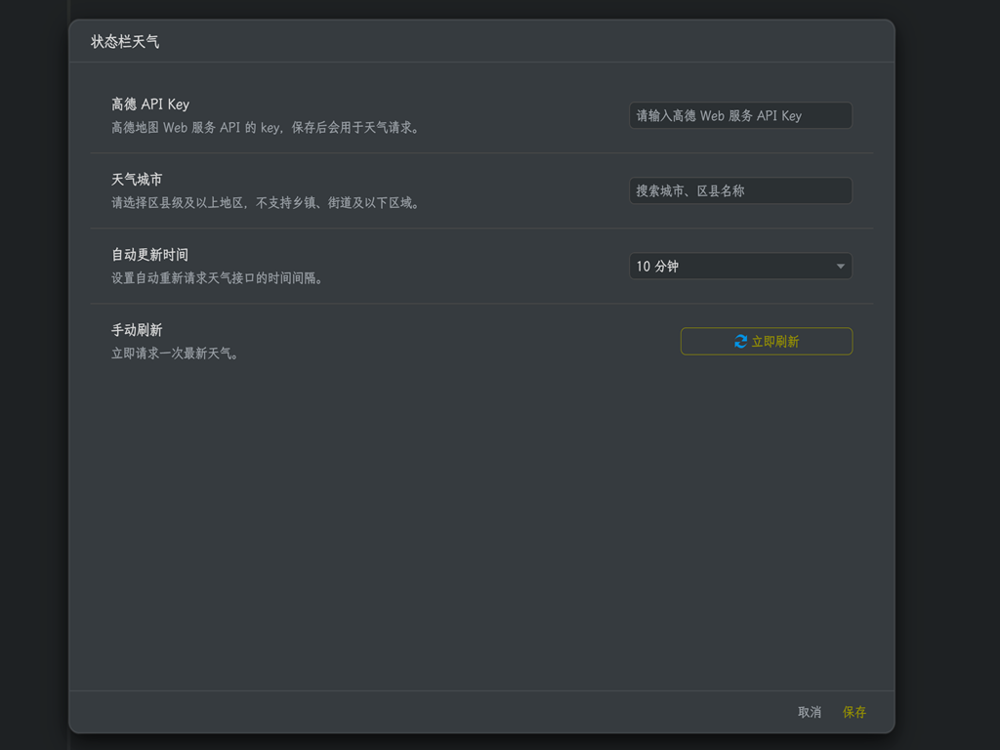

# SiYuan Weather



SiYuan Weather shows real-time weather in the SiYuan status bar.

## Features

- Search and select supported cities and districts
- Display current weather, temperature, humidity, wind direction, and wind power
- Automatically refresh every 5, 10, 30, or 60 minutes
- Click the status bar weather to refresh and view details
- Use an Amap Web Service API key configured by the user

## Setup

1. Apply for an Amap Web Service API key.
2. Open the plugin settings from the top bar.
3. Enter the API key, search for a city or district, and choose the refresh interval.
4. Save the settings.

The city selector supports districts and higher-level administrative areas included in the bundled Amap city data. The plugin only requests real-time weather from Amap; it does not provide forecast data.

## Privacy

The API key and selected city are stored in SiYuan plugin data. Weather requests are sent directly to the Amap weather service using the configured key.

## Feedback

If you run into problems or have feature suggestions, please [open an issue](https://github.com/haoge321/siyuan-plugin-weather/issues).

## Development

```powershell
npm install
npm run dev
```

Build output is written to `weather`, which contains the complete plugin package.
After `npm run build`, the package is also copied automatically to the configured SiYuan plugin directory in `webpack.config.js` when that directory exists.

## License

[MIT](LICENSE)
